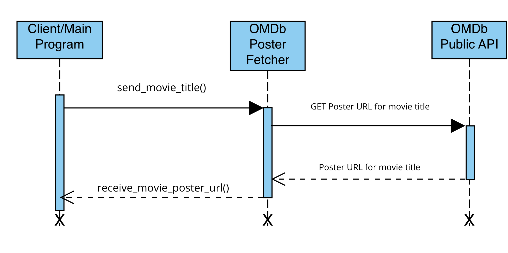

# OMDb Poster Fetcher
The **OMDb Poster Fetcher** microservice receives requests for movie poster URLs and responds to the calling entity with the movie poster URL.
## Communication Contract

**OMDb Poster Fetcher** runs as a **ZeroMQ** server. It expects to receive a ZeroMQ Context socket which contains a bytestring of a movie title. In response, **OMDb Poster Fetcher** makes a GET request to the OMDb API for the specific film and responds to the calling client with a ZeroMQ Context socket containing a bytestring of the film's poster URL.

### Requesting Data

1. Receive an OMDb API key from https://www.omdbapi.com/apikey.aspx.
2. Pull repo and create Python virtual environment of your choice for your specific OS.
3. Install dependencies: `pip install -r requirements.txt`.
4. Replace `OMDB_API_KEY = os.getenv("OMDB_API_KEY")` with `OMDB_API_KEY = 'YOUR_API_KEY'`. This should be the key you retrieved in step 1. Save program.
5. Start the microservice: `python service.py`.

**Sample Call**
<br>In the same directory where you are running your virtual environment, open a Python interactive terminal or save as a new script:

```
import zmq

context = zmq.Context()
socket = context.socket(zmq.REQ)

socket.connect("tcp://localhost:5555")

socket.send_string("gone in 60 seconds")
```
Your terminal window should display https://m.media-amazon.com/images/M/MV5BMTIwMzExNDEwN15BMl5BanBnXkFtZTYwODMxMzg2._V1_SX300.jpg.

### Receiving Data
Receiving the bytestring from **OMDb Poster Fetcher** is as simple as adding a single command. This should be entered after the above request is made:
```
print(socket.recv_string())
```

Your terminal window should display https://m.media-amazon.com/images/M/MV5BMTIwMzExNDEwN15BMl5BanBnXkFtZTYwODMxMzg2._V1_SX300.jpg.

Depending on your needs, you can wrap the entire request/receive in a `while True:` loop to continously facilitate requests. Additionally, the result of `socket.recv_string()` could be a return value instead of a `print()` statement.

## UML Diagram

Below is a high-level representation of the OMDb Poster Fetcher workflow.

